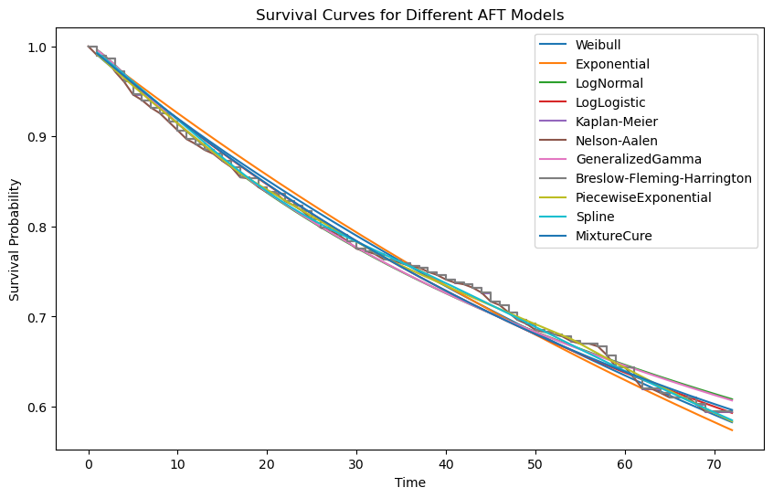
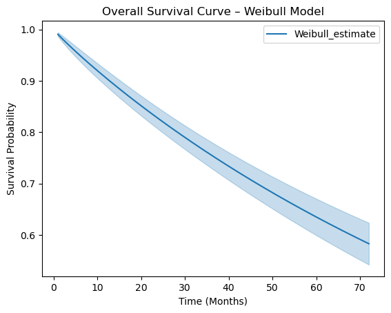
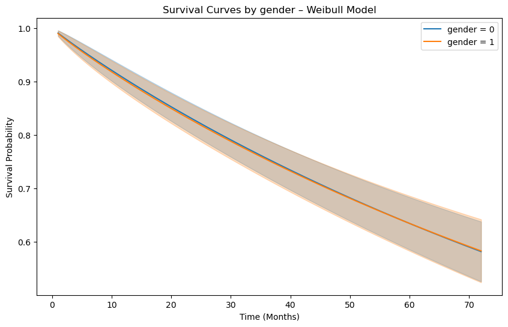
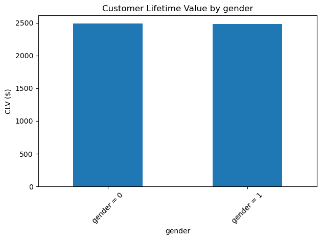

## Survival Analysis
## Homework 3

### Amalya Tadevosyan

Necessary Libraries


```python
import os
import pandas as pd
import numpy as np
from sklearn.preprocessing import LabelEncoder
import matplotlib.pyplot as plt
from lifelines import WeibullFitter, ExponentialFitter, LogNormalFitter, LogLogisticFitter, KaplanMeierFitter, NelsonAalenFitter, GeneralizedGammaFitter, BreslowFlemingHarringtonFitter, PiecewiseExponentialFitter, SplineFitter, MixtureCureFitter
```


```python
# Creating absolute path
data_path = os.path.join(os.getcwd(), 'data', 'telco.csv')
```


```python
# Importing dataset
df = pd.read_csv("telco.csv")
df.head()
```


<div>
<style scoped>
    .dataframe tbody tr th:only-of-type {
        vertical-align: middle;
    }

    .dataframe tbody tr th {
        vertical-align: top;
    }

    .dataframe thead th {
        text-align: right;
    }
</style>
<table border="1" class="dataframe">
  <thead>
    <tr style="text-align: right;">
      <th></th>
      <th>ID</th>
      <th>region</th>
      <th>tenure</th>
      <th>age</th>
      <th>marital</th>
      <th>address</th>
      <th>income</th>
      <th>ed</th>
      <th>retire</th>
      <th>gender</th>
      <th>voice</th>
      <th>internet</th>
      <th>forward</th>
      <th>custcat</th>
      <th>churn</th>
    </tr>
  </thead>
  <tbody>
    <tr>
      <th>0</th>
      <td>1</td>
      <td>Zone 2</td>
      <td>13</td>
      <td>44</td>
      <td>Married</td>
      <td>9</td>
      <td>64</td>
      <td>College degree</td>
      <td>No</td>
      <td>Male</td>
      <td>No</td>
      <td>No</td>
      <td>Yes</td>
      <td>Basic service</td>
      <td>Yes</td>
    </tr>
    <tr>
      <th>1</th>
      <td>2</td>
      <td>Zone 3</td>
      <td>11</td>
      <td>33</td>
      <td>Married</td>
      <td>7</td>
      <td>136</td>
      <td>Post-undergraduate degree</td>
      <td>No</td>
      <td>Male</td>
      <td>Yes</td>
      <td>No</td>
      <td>Yes</td>
      <td>Total service</td>
      <td>Yes</td>
    </tr>
    <tr>
      <th>2</th>
      <td>3</td>
      <td>Zone 3</td>
      <td>68</td>
      <td>52</td>
      <td>Married</td>
      <td>24</td>
      <td>116</td>
      <td>Did not complete high school</td>
      <td>No</td>
      <td>Female</td>
      <td>No</td>
      <td>No</td>
      <td>No</td>
      <td>Plus service</td>
      <td>No</td>
    </tr>
    <tr>
      <th>3</th>
      <td>4</td>
      <td>Zone 2</td>
      <td>33</td>
      <td>33</td>
      <td>Unmarried</td>
      <td>12</td>
      <td>33</td>
      <td>High school degree</td>
      <td>No</td>
      <td>Female</td>
      <td>No</td>
      <td>No</td>
      <td>No</td>
      <td>Basic service</td>
      <td>Yes</td>
    </tr>
    <tr>
      <th>4</th>
      <td>5</td>
      <td>Zone 2</td>
      <td>23</td>
      <td>30</td>
      <td>Married</td>
      <td>9</td>
      <td>30</td>
      <td>Did not complete high school</td>
      <td>No</td>
      <td>Male</td>
      <td>No</td>
      <td>No</td>
      <td>Yes</td>
      <td>Plus service</td>
      <td>No</td>
    </tr>
  </tbody>
</table>
</div>


```python
df.isnull().sum()
```


    ID          0
    region      0
    tenure      0
    age         0
    marital     0
    address     0
    income      0
    ed          0
    retire      0
    gender      0
    voice       0
    internet    0
    forward     0
    custcat     0
    churn       0
    dtype: int64


```python
df.dtypes
```


    ID           int64
    region      object
    tenure       int64
    age          int64
    marital     object
    address      int64
    income       int64
    ed          object
    retire      object
    gender      object
    voice       object
    internet    object
    forward     object
    custcat     object
    churn       object
    dtype: object


```python
df["churn"] = df["churn"].apply(lambda x: 1 if x == "Yes" else 0)
df.head()
```


<div>
<style scoped>
    .dataframe tbody tr th:only-of-type {
        vertical-align: middle;
    }

    .dataframe tbody tr th {
        vertical-align: top;
    }

    .dataframe thead th {
        text-align: right;
    }
</style>
<table border="1" class="dataframe">
  <thead>
    <tr style="text-align: right;">
      <th></th>
      <th>ID</th>
      <th>region</th>
      <th>tenure</th>
      <th>age</th>
      <th>marital</th>
      <th>address</th>
      <th>income</th>
      <th>ed</th>
      <th>retire</th>
      <th>gender</th>
      <th>voice</th>
      <th>internet</th>
      <th>forward</th>
      <th>custcat</th>
      <th>churn</th>
    </tr>
  </thead>
  <tbody>
    <tr>
      <th>0</th>
      <td>1</td>
      <td>Zone 2</td>
      <td>13</td>
      <td>44</td>
      <td>Married</td>
      <td>9</td>
      <td>64</td>
      <td>College degree</td>
      <td>No</td>
      <td>Male</td>
      <td>No</td>
      <td>No</td>
      <td>Yes</td>
      <td>Basic service</td>
      <td>1</td>
    </tr>
    <tr>
      <th>1</th>
      <td>2</td>
      <td>Zone 3</td>
      <td>11</td>
      <td>33</td>
      <td>Married</td>
      <td>7</td>
      <td>136</td>
      <td>Post-undergraduate degree</td>
      <td>No</td>
      <td>Male</td>
      <td>Yes</td>
      <td>No</td>
      <td>Yes</td>
      <td>Total service</td>
      <td>1</td>
    </tr>
    <tr>
      <th>2</th>
      <td>3</td>
      <td>Zone 3</td>
      <td>68</td>
      <td>52</td>
      <td>Married</td>
      <td>24</td>
      <td>116</td>
      <td>Did not complete high school</td>
      <td>No</td>
      <td>Female</td>
      <td>No</td>
      <td>No</td>
      <td>No</td>
      <td>Plus service</td>
      <td>0</td>
    </tr>
    <tr>
      <th>3</th>
      <td>4</td>
      <td>Zone 2</td>
      <td>33</td>
      <td>33</td>
      <td>Unmarried</td>
      <td>12</td>
      <td>33</td>
      <td>High school degree</td>
      <td>No</td>
      <td>Female</td>
      <td>No</td>
      <td>No</td>
      <td>No</td>
      <td>Basic service</td>
      <td>1</td>
    </tr>
    <tr>
      <th>4</th>
      <td>5</td>
      <td>Zone 2</td>
      <td>23</td>
      <td>30</td>
      <td>Married</td>
      <td>9</td>
      <td>30</td>
      <td>Did not complete high school</td>
      <td>No</td>
      <td>Male</td>
      <td>No</td>
      <td>No</td>
      <td>Yes</td>
      <td>Plus service</td>
      <td>0</td>
    </tr>
  </tbody>
</table>
</div>


```python
# Perform one-hot encoding for categorical variables
df_encoded = pd.get_dummies(df, columns=['region', 'marital', 'ed', 'custcat'], drop_first=True)
df_encoded.head()
```


<div>
<style scoped>
    .dataframe tbody tr th:only-of-type {
        vertical-align: middle;
    }

    .dataframe tbody tr th {
        vertical-align: top;
    }

    .dataframe thead th {
        text-align: right;
    }
</style>
<table border="1" class="dataframe">
  <thead>
    <tr style="text-align: right;">
      <th></th>
      <th>ID</th>
      <th>tenure</th>
      <th>age</th>
      <th>address</th>
      <th>income</th>
      <th>retire</th>
      <th>gender</th>
      <th>voice</th>
      <th>internet</th>
      <th>forward</th>
      <th>...</th>
      <th>region_Zone 2</th>
      <th>region_Zone 3</th>
      <th>marital_Unmarried</th>
      <th>ed_Did not complete high school</th>
      <th>ed_High school degree</th>
      <th>ed_Post-undergraduate degree</th>
      <th>ed_Some college</th>
      <th>custcat_E-service</th>
      <th>custcat_Plus service</th>
      <th>custcat_Total service</th>
    </tr>
  </thead>
  <tbody>
    <tr>
      <th>0</th>
      <td>1</td>
      <td>13</td>
      <td>44</td>
      <td>9</td>
      <td>64</td>
      <td>No</td>
      <td>Male</td>
      <td>No</td>
      <td>No</td>
      <td>Yes</td>
      <td>...</td>
      <td>True</td>
      <td>False</td>
      <td>False</td>
      <td>False</td>
      <td>False</td>
      <td>False</td>
      <td>False</td>
      <td>False</td>
      <td>False</td>
      <td>False</td>
    </tr>
    <tr>
      <th>1</th>
      <td>2</td>
      <td>11</td>
      <td>33</td>
      <td>7</td>
      <td>136</td>
      <td>No</td>
      <td>Male</td>
      <td>Yes</td>
      <td>No</td>
      <td>Yes</td>
      <td>...</td>
      <td>False</td>
      <td>True</td>
      <td>False</td>
      <td>False</td>
      <td>False</td>
      <td>True</td>
      <td>False</td>
      <td>False</td>
      <td>False</td>
      <td>True</td>
    </tr>
    <tr>
      <th>2</th>
      <td>3</td>
      <td>68</td>
      <td>52</td>
      <td>24</td>
      <td>116</td>
      <td>No</td>
      <td>Female</td>
      <td>No</td>
      <td>No</td>
      <td>No</td>
      <td>...</td>
      <td>False</td>
      <td>True</td>
      <td>False</td>
      <td>True</td>
      <td>False</td>
      <td>False</td>
      <td>False</td>
      <td>False</td>
      <td>True</td>
      <td>False</td>
    </tr>
    <tr>
      <th>3</th>
      <td>4</td>
      <td>33</td>
      <td>33</td>
      <td>12</td>
      <td>33</td>
      <td>No</td>
      <td>Female</td>
      <td>No</td>
      <td>No</td>
      <td>No</td>
      <td>...</td>
      <td>True</td>
      <td>False</td>
      <td>True</td>
      <td>False</td>
      <td>True</td>
      <td>False</td>
      <td>False</td>
      <td>False</td>
      <td>False</td>
      <td>False</td>
    </tr>
    <tr>
      <th>4</th>
      <td>5</td>
      <td>23</td>
      <td>30</td>
      <td>9</td>
      <td>30</td>
      <td>No</td>
      <td>Male</td>
      <td>No</td>
      <td>No</td>
      <td>Yes</td>
      <td>...</td>
      <td>True</td>
      <td>False</td>
      <td>False</td>
      <td>True</td>
      <td>False</td>
      <td>False</td>
      <td>False</td>
      <td>False</td>
      <td>True</td>
      <td>False</td>
    </tr>
  </tbody>
</table>
<p>5 rows × 21 columns</p>
</div>


```python
# label encoding for binary columns
le = LabelEncoder()
df['retire'] = le.fit_transform(df['retire'])
df['voice'] = le.fit_transform(df['voice'])
df['internet'] = le.fit_transform(df['internet'])
df['forward'] = le.fit_transform(df['forward'])
df['gender'] = le.fit_transform(df['gender'])
```


```python
df_encoded.isnull().sum()
```


    ID                                 0
    tenure                             0
    age                                0
    address                            0
    income                             0
    retire                             0
    gender                             0
    voice                              0
    internet                           0
    forward                            0
    churn                              0
    region_Zone 2                      0
    region_Zone 3                      0
    marital_Unmarried                  0
    ed_Did not complete high school    0
    ed_High school degree              0
    ed_Post-undergraduate degree       0
    ed_Some college                    0
    custcat_E-service                  0
    custcat_Plus service               0
    custcat_Total service              0
    dtype: int64


#### Exponential AFT Model


```python
exp = ExponentialFitter()
exp.fit(df["tenure"], df["churn"], label="Exponential")
exp.print_summary()
```


<div>
<style scoped>
    .dataframe tbody tr th:only-of-type {
        vertical-align: middle;
    }

    .dataframe tbody tr th {
        vertical-align: top;
    }

    .dataframe thead th {
        text-align: right;
    }
</style>
<table border="1" class="dataframe">
  <tbody>
    <tr>
      <th>model</th>
      <td>lifelines.ExponentialFitter</td>
    </tr>
    <tr>
      <th>number of observations</th>
      <td>1000</td>
    </tr>
    <tr>
      <th>number of events observed</th>
      <td>274</td>
    </tr>
    <tr>
      <th>log-likelihood</th>
      <td>-1606.98</td>
    </tr>
    <tr>
      <th>hypothesis</th>
      <td>lambda_ != 0</td>
    </tr>
  </tbody>
</table>
</div><table border="1" class="dataframe">
  <thead>
    <tr style="text-align: right;">
      <th style="min-width: 12px;"></th>
      <th style="min-width: 12px;">coef</th>
      <th style="min-width: 12px;">se(coef)</th>
      <th style="min-width: 12px;">coef lower 95%</th>
      <th style="min-width: 12px;">coef upper 95%</th>
      <th style="min-width: 12px;">cmp to</th>
      <th style="min-width: 12px;">z</th>
      <th style="min-width: 12px;">p</th>
      <th style="min-width: 12px;">-log2(p)</th>
    </tr>
  </thead>
  <tbody>
    <tr>
      <th>lambda_</th>
      <td>129.66</td>
      <td>7.83</td>
      <td>114.30</td>
      <td>145.01</td>
      <td>0.00</td>
      <td>16.55</td>
      <td>&lt;0.005</td>
      <td>202.03</td>
    </tr>
  </tbody>
</table><br><div>
<style scoped>
    .dataframe tbody tr th:only-of-type {
        vertical-align: middle;
    }

    .dataframe tbody tr th {
        vertical-align: top;
    }

    .dataframe thead th {
        text-align: right;
    }
</style>
<table border="1" class="dataframe">
  <tbody>
    <tr>
      <th>AIC</th>
      <td>3215.96</td>
    </tr>
  </tbody>
</table>
</div>


#### WeibullAFTFitter AFT Model


```python
weibull = WeibullFitter()
weibull.fit(df["tenure"], df["churn"], label="Weibull")
weibull.print_summary()
```


<div>
<style scoped>
    .dataframe tbody tr th:only-of-type {
        vertical-align: middle;
    }

    .dataframe tbody tr th {
        vertical-align: top;
    }

    .dataframe thead th {
        text-align: right;
    }
</style>
<table border="1" class="dataframe">
  <tbody>
    <tr>
      <th>model</th>
      <td>lifelines.WeibullFitter</td>
    </tr>
    <tr>
      <th>number of observations</th>
      <td>1000</td>
    </tr>
    <tr>
      <th>number of events observed</th>
      <td>274</td>
    </tr>
    <tr>
      <th>log-likelihood</th>
      <td>-1606.43</td>
    </tr>
    <tr>
      <th>hypothesis</th>
      <td>lambda_ != 1, rho_ != 1</td>
    </tr>
  </tbody>
</table>
</div><table border="1" class="dataframe">
  <thead>
    <tr style="text-align: right;">
      <th style="min-width: 12px;"></th>
      <th style="min-width: 12px;">coef</th>
      <th style="min-width: 12px;">se(coef)</th>
      <th style="min-width: 12px;">coef lower 95%</th>
      <th style="min-width: 12px;">coef upper 95%</th>
      <th style="min-width: 12px;">cmp to</th>
      <th style="min-width: 12px;">z</th>
      <th style="min-width: 12px;">p</th>
      <th style="min-width: 12px;">-log2(p)</th>
    </tr>
  </thead>
  <tbody>
    <tr>
      <th>lambda_</th>
      <td>138.09</td>
      <td>12.38</td>
      <td>113.82</td>
      <td>162.36</td>
      <td>1.00</td>
      <td>11.07</td>
      <td>&lt;0.005</td>
      <td>92.25</td>
    </tr>
    <tr>
      <th>rho_</th>
      <td>0.95</td>
      <td>0.05</td>
      <td>0.85</td>
      <td>1.05</td>
      <td>1.00</td>
      <td>-1.07</td>
      <td>0.29</td>
      <td>1.80</td>
    </tr>
  </tbody>
</table><br><div>
<style scoped>
    .dataframe tbody tr th:only-of-type {
        vertical-align: middle;
    }

    .dataframe tbody tr th {
        vertical-align: top;
    }

    .dataframe thead th {
        text-align: right;
    }
</style>
<table border="1" class="dataframe">
  <tbody>
    <tr>
      <th>AIC</th>
      <td>3216.86</td>
    </tr>
  </tbody>
</table>
</div>


#### LogNormalFitter Model


```python
lognorm = LogNormalFitter()
lognorm.fit(df["tenure"], df["churn"], label="LogNormal")
lognorm.print_summary()
```


<div>
<style scoped>
    .dataframe tbody tr th:only-of-type {
        vertical-align: middle;
    }

    .dataframe tbody tr th {
        vertical-align: top;
    }

    .dataframe thead th {
        text-align: right;
    }
</style>
<table border="1" class="dataframe">
  <tbody>
    <tr>
      <th>model</th>
      <td>lifelines.LogNormalFitter</td>
    </tr>
    <tr>
      <th>number of observations</th>
      <td>1000</td>
    </tr>
    <tr>
      <th>number of events observed</th>
      <td>274</td>
    </tr>
    <tr>
      <th>log-likelihood</th>
      <td>-1602.52</td>
    </tr>
    <tr>
      <th>hypothesis</th>
      <td>mu_ != 0, sigma_ != 1</td>
    </tr>
  </tbody>
</table>
</div><table border="1" class="dataframe">
  <thead>
    <tr style="text-align: right;">
      <th style="min-width: 12px;"></th>
      <th style="min-width: 12px;">coef</th>
      <th style="min-width: 12px;">se(coef)</th>
      <th style="min-width: 12px;">coef lower 95%</th>
      <th style="min-width: 12px;">coef upper 95%</th>
      <th style="min-width: 12px;">cmp to</th>
      <th style="min-width: 12px;">z</th>
      <th style="min-width: 12px;">p</th>
      <th style="min-width: 12px;">-log2(p)</th>
    </tr>
  </thead>
  <tbody>
    <tr>
      <th>mu_</th>
      <td>4.77</td>
      <td>0.10</td>
      <td>4.57</td>
      <td>4.98</td>
      <td>0.00</td>
      <td>46.06</td>
      <td>&lt;0.005</td>
      <td>inf</td>
    </tr>
    <tr>
      <th>sigma_</th>
      <td>1.81</td>
      <td>0.09</td>
      <td>1.64</td>
      <td>1.97</td>
      <td>1.00</td>
      <td>9.37</td>
      <td>&lt;0.005</td>
      <td>66.94</td>
    </tr>
  </tbody>
</table><br><div>
<style scoped>
    .dataframe tbody tr th:only-of-type {
        vertical-align: middle;
    }

    .dataframe tbody tr th {
        vertical-align: top;
    }

    .dataframe thead th {
        text-align: right;
    }
</style>
<table border="1" class="dataframe">
  <tbody>
    <tr>
      <th>AIC</th>
      <td>3209.04</td>
    </tr>
  </tbody>
</table>
</div>


#### LogLogisticFitter Model


```python
loglog = LogLogisticFitter()
loglog.fit(df["tenure"], df["churn"], label="LogLogistic")
loglog.print_summary()
```


<div>
<style scoped>
    .dataframe tbody tr th:only-of-type {
        vertical-align: middle;
    }

    .dataframe tbody tr th {
        vertical-align: top;
    }

    .dataframe thead th {
        text-align: right;
    }
</style>
<table border="1" class="dataframe">
  <tbody>
    <tr>
      <th>model</th>
      <td>lifelines.LogLogisticFitter</td>
    </tr>
    <tr>
      <th>number of observations</th>
      <td>1000</td>
    </tr>
    <tr>
      <th>number of events observed</th>
      <td>274</td>
    </tr>
    <tr>
      <th>log-likelihood</th>
      <td>-1605.21</td>
    </tr>
    <tr>
      <th>hypothesis</th>
      <td>alpha_ != 1, beta_ != 1</td>
    </tr>
  </tbody>
</table>
</div><table border="1" class="dataframe">
  <thead>
    <tr style="text-align: right;">
      <th style="min-width: 12px;"></th>
      <th style="min-width: 12px;">coef</th>
      <th style="min-width: 12px;">se(coef)</th>
      <th style="min-width: 12px;">coef lower 95%</th>
      <th style="min-width: 12px;">coef upper 95%</th>
      <th style="min-width: 12px;">cmp to</th>
      <th style="min-width: 12px;">z</th>
      <th style="min-width: 12px;">p</th>
      <th style="min-width: 12px;">-log2(p)</th>
    </tr>
  </thead>
  <tbody>
    <tr>
      <th>alpha_</th>
      <td>103.39</td>
      <td>9.13</td>
      <td>85.50</td>
      <td>121.28</td>
      <td>1.00</td>
      <td>11.22</td>
      <td>&lt;0.005</td>
      <td>94.60</td>
    </tr>
    <tr>
      <th>beta_</th>
      <td>1.04</td>
      <td>0.05</td>
      <td>0.93</td>
      <td>1.15</td>
      <td>1.00</td>
      <td>0.73</td>
      <td>0.46</td>
      <td>1.11</td>
    </tr>
  </tbody>
</table><br><div>
<style scoped>
    .dataframe tbody tr th:only-of-type {
        vertical-align: middle;
    }

    .dataframe tbody tr th {
        vertical-align: top;
    }

    .dataframe thead th {
        text-align: right;
    }
</style>
<table border="1" class="dataframe">
  <tbody>
    <tr>
      <th>AIC</th>
      <td>3214.42</td>
    </tr>
  </tbody>
</table>
</div>


#### KaplanMeierFitter Model


```python
kmf = KaplanMeierFitter()
kmf.fit(df["tenure"], df["churn"], label="Kaplan-Meier")
```


    <lifelines.KaplanMeierFitter:"Kaplan-Meier", fitted with 1000 total observations, 726 right-censored observations>


#### NelsonAalenFitter Model


```python
naf = NelsonAalenFitter()
naf.fit(df["tenure"], df["churn"], label="Nelson-Aalen")
naf.survival_function_ = np.exp(-naf.cumulative_hazard_)
```

#### GeneralizedGammaFitter Model


```python
gg = GeneralizedGammaFitter()
gg.fit(df["tenure"], df["churn"], label="GeneralizedGamma")
gg.print_summary()
```


<div>
<style scoped>
    .dataframe tbody tr th:only-of-type {
        vertical-align: middle;
    }

    .dataframe tbody tr th {
        vertical-align: top;
    }

    .dataframe thead th {
        text-align: right;
    }
</style>
<table border="1" class="dataframe">
  <tbody>
    <tr>
      <th>model</th>
      <td>lifelines.GeneralizedGammaFitter</td>
    </tr>
    <tr>
      <th>number of observations</th>
      <td>1000</td>
    </tr>
    <tr>
      <th>number of events observed</th>
      <td>274</td>
    </tr>
    <tr>
      <th>log-likelihood</th>
      <td>-1602.50</td>
    </tr>
    <tr>
      <th>hypothesis</th>
      <td>mu_ != 0, ln_sigma_ != 0, lambda_ != 1</td>
    </tr>
  </tbody>
</table>
</div><table border="1" class="dataframe">
  <thead>
    <tr style="text-align: right;">
      <th style="min-width: 12px;"></th>
      <th style="min-width: 12px;">coef</th>
      <th style="min-width: 12px;">se(coef)</th>
      <th style="min-width: 12px;">coef lower 95%</th>
      <th style="min-width: 12px;">coef upper 95%</th>
      <th style="min-width: 12px;">cmp to</th>
      <th style="min-width: 12px;">z</th>
      <th style="min-width: 12px;">p</th>
      <th style="min-width: 12px;">-log2(p)</th>
    </tr>
  </thead>
  <tbody>
    <tr>
      <th>mu_</th>
      <td>4.79</td>
      <td>0.14</td>
      <td>4.51</td>
      <td>5.06</td>
      <td>0.00</td>
      <td>34.09</td>
      <td>&lt;0.005</td>
      <td>843.87</td>
    </tr>
    <tr>
      <th>ln_sigma_</th>
      <td>0.57</td>
      <td>0.14</td>
      <td>0.29</td>
      <td>0.85</td>
      <td>0.00</td>
      <td>4.02</td>
      <td>&lt;0.005</td>
      <td>14.08</td>
    </tr>
    <tr>
      <th>lambda_</th>
      <td>0.05</td>
      <td>0.33</td>
      <td>-0.60</td>
      <td>0.70</td>
      <td>1.00</td>
      <td>-2.87</td>
      <td>&lt;0.005</td>
      <td>7.92</td>
    </tr>
  </tbody>
</table><br><div>
<style scoped>
    .dataframe tbody tr th:only-of-type {
        vertical-align: middle;
    }

    .dataframe tbody tr th {
        vertical-align: top;
    }

    .dataframe thead th {
        text-align: right;
    }
</style>
<table border="1" class="dataframe">
  <tbody>
    <tr>
      <th>AIC</th>
      <td>3211.01</td>
    </tr>
  </tbody>
</table>
</div>


#### BreslowFlemingHarringtonFitter Model


```python
bfhf = BreslowFlemingHarringtonFitter()
bfhf.fit(df["tenure"], df["churn"], label="Breslow-Fleming-Harrington")
```


    <lifelines.BreslowFlemingHarringtonFitter:"Breslow-Fleming-Harrington", fitted with 1000 total observations, 726 right-censored observations>


#### PiecewiseExponentialFitter Model


```python
breakpoints = df_encoded['tenure'].quantile([0.25, 0.5, 0.75]).values
```


```python
pwexp = PiecewiseExponentialFitter(breakpoints=breakpoints)
pwexp.fit(df["tenure"], df["churn"], label="PiecewiseExponential")
```


    <lifelines.PiecewiseExponentialFitter:"PiecewiseExponential", fitted with 1000 total observations, 726 right-censored observations>


#### SplineFitter Model


```python
knot_locations = np.arange(0, df["tenure"].max(), 12)[1:]
spline = SplineFitter(knot_locations=knot_locations)
spline.fit(df["tenure"], df["churn"], label="Spline")
spline.print_summary()
```


<div>
<style scoped>
    .dataframe tbody tr th:only-of-type {
        vertical-align: middle;
    }

    .dataframe tbody tr th {
        vertical-align: top;
    }

    .dataframe thead th {
        text-align: right;
    }
</style>
<table border="1" class="dataframe">
  <tbody>
    <tr>
      <th>model</th>
      <td>lifelines.SplineFitter</td>
    </tr>
    <tr>
      <th>number of observations</th>
      <td>1000</td>
    </tr>
    <tr>
      <th>number of events observed</th>
      <td>274</td>
    </tr>
    <tr>
      <th>log-likelihood</th>
      <td>-1603.76</td>
    </tr>
    <tr>
      <th>hypothesis</th>
      <td>phi_0_ != 0, phi_1_ != 0, phi_2_ != 0, phi_3_ ...</td>
    </tr>
  </tbody>
</table>
</div><table border="1" class="dataframe">
  <thead>
    <tr style="text-align: right;">
      <th style="min-width: 12px;"></th>
      <th style="min-width: 12px;">coef</th>
      <th style="min-width: 12px;">se(coef)</th>
      <th style="min-width: 12px;">coef lower 95%</th>
      <th style="min-width: 12px;">coef upper 95%</th>
      <th style="min-width: 12px;">cmp to</th>
      <th style="min-width: 12px;">z</th>
      <th style="min-width: 12px;">p</th>
      <th style="min-width: 12px;">-log2(p)</th>
    </tr>
  </thead>
  <tbody>
    <tr>
      <th>phi_0_</th>
      <td>-4.96</td>
      <td>0.26</td>
      <td>-5.47</td>
      <td>-4.44</td>
      <td>0.00</td>
      <td>-18.89</td>
      <td>&lt;0.005</td>
      <td>261.94</td>
    </tr>
    <tr>
      <th>phi_1_</th>
      <td>1.08</td>
      <td>0.09</td>
      <td>0.91</td>
      <td>1.25</td>
      <td>0.00</td>
      <td>12.40</td>
      <td>&lt;0.005</td>
      <td>114.92</td>
    </tr>
    <tr>
      <th>phi_2_</th>
      <td>0.74</td>
      <td>0.57</td>
      <td>-0.38</td>
      <td>1.86</td>
      <td>0.00</td>
      <td>1.30</td>
      <td>0.19</td>
      <td>2.37</td>
    </tr>
    <tr>
      <th>phi_3_</th>
      <td>-0.59</td>
      <td>1.68</td>
      <td>-3.90</td>
      <td>2.71</td>
      <td>0.00</td>
      <td>-0.35</td>
      <td>0.72</td>
      <td>0.47</td>
    </tr>
    <tr>
      <th>phi_4_</th>
      <td>-0.35</td>
      <td>2.22</td>
      <td>-4.71</td>
      <td>4.00</td>
      <td>0.00</td>
      <td>-0.16</td>
      <td>0.87</td>
      <td>0.20</td>
    </tr>
  </tbody>
</table><br><div>
<style scoped>
    .dataframe tbody tr th:only-of-type {
        vertical-align: middle;
    }

    .dataframe tbody tr th {
        vertical-align: top;
    }

    .dataframe thead th {
        text-align: right;
    }
</style>
<table border="1" class="dataframe">
  <tbody>
    <tr>
      <th>AIC</th>
      <td>3217.52</td>
    </tr>
  </tbody>
</table>
</div>


#### MixtureCureFitter Model


```python
base_model = WeibullFitter()
mcf = MixtureCureFitter(base_fitter=base_model)
mcf.fit(df["tenure"], df["churn"], label="MixtureCure")
mcf.print_summary()
```


<div>
<style scoped>
    .dataframe tbody tr th:only-of-type {
        vertical-align: middle;
    }

    .dataframe tbody tr th {
        vertical-align: top;
    }

    .dataframe thead th {
        text-align: right;
    }
</style>
<table border="1" class="dataframe">
  <tbody>
    <tr>
      <th>model</th>
      <td>lifelines.MixtureCureFitter</td>
    </tr>
    <tr>
      <th>number of observations</th>
      <td>1000</td>
    </tr>
    <tr>
      <th>number of events observed</th>
      <td>274</td>
    </tr>
    <tr>
      <th>log-likelihood</th>
      <td>-1605.68</td>
    </tr>
    <tr>
      <th>hypothesis</th>
      <td>cured_fraction_ != 0, lambda_ != 1, rho_ != 1</td>
    </tr>
  </tbody>
</table>
</div><table border="1" class="dataframe">
  <thead>
    <tr style="text-align: right;">
      <th style="min-width: 12px;"></th>
      <th style="min-width: 12px;">coef</th>
      <th style="min-width: 12px;">se(coef)</th>
      <th style="min-width: 12px;">coef lower 95%</th>
      <th style="min-width: 12px;">coef upper 95%</th>
      <th style="min-width: 12px;">cmp to</th>
      <th style="min-width: 12px;">z</th>
      <th style="min-width: 12px;">p</th>
      <th style="min-width: 12px;">-log2(p)</th>
    </tr>
  </thead>
  <tbody>
    <tr>
      <th>cured_fraction_</th>
      <td>0.38</td>
      <td>0.16</td>
      <td>0.07</td>
      <td>0.69</td>
      <td>0.00</td>
      <td>2.42</td>
      <td>0.02</td>
      <td>6.01</td>
    </tr>
    <tr>
      <th>lambda_</th>
      <td>68.72</td>
      <td>26.31</td>
      <td>17.16</td>
      <td>120.28</td>
      <td>1.00</td>
      <td>2.57</td>
      <td>0.01</td>
      <td>6.64</td>
    </tr>
    <tr>
      <th>rho_</th>
      <td>1.02</td>
      <td>0.08</td>
      <td>0.87</td>
      <td>1.18</td>
      <td>1.00</td>
      <td>0.31</td>
      <td>0.76</td>
      <td>0.40</td>
    </tr>
  </tbody>
</table><br><div>
<style scoped>
    .dataframe tbody tr th:only-of-type {
        vertical-align: middle;
    }

    .dataframe tbody tr th {
        vertical-align: top;
    }

    .dataframe thead th {
        text-align: right;
    }
</style>
<table border="1" class="dataframe">
  <tbody>
    <tr>
      <th>AIC</th>
      <td>3217.36</td>
    </tr>
  </tbody>
</table>
</div>


### Compare the models


```python
from lifelines.utils import concordance_index

fitted_models = {
    "Weibull": weibull,
    "Exponential": exp,
    "LogNormal": lognorm,
    "LogLogistic": loglog,
    "Kaplan-Meier": kmf,
    "Nelson-Aalen": naf,
    "GeneralizedGamma": gg,
    "Breslow-Fleming-Harrington": bfhf,
    "PiecewiseExponential": pwexp,
    "Spline": spline,
    "MixtureCure": mcf
}
```


```python
comparison = []

for name, model in fitted_models.items():
    # Estimate mean survival time numerically
    sf = model.survival_function_
    time_deltas = sf.index.to_series().diff().fillna(0)
    mean_time = (sf.values.flatten() * time_deltas).sum()

    comparison.append({
        "Model": name,
        "AIC": getattr(model, "AIC_", "N/A"),
        "Log-likelihood": getattr(model, "log_likelihood_", "N/A"),
        "Estimated Mean Survival Time": mean_time,
    })
```


```python
comparison_df = pd.DataFrame(comparison).sort_values(by="Estimated Mean Survival Time").reset_index(drop=True)
comparison_df
```


<div>
<style scoped>
    .dataframe tbody tr th:only-of-type {
        vertical-align: middle;
    }

    .dataframe tbody tr th {
        vertical-align: top;
    }

    .dataframe thead th {
        text-align: right;
    }
</style>
<table border="1" class="dataframe">
  <thead>
    <tr style="text-align: right;">
      <th></th>
      <th>Model</th>
      <th>AIC</th>
      <th>Log-likelihood</th>
      <th>Estimated Mean Survival Time</th>
    </tr>
  </thead>
  <tbody>
    <tr>
      <th>0</th>
      <td>GeneralizedGamma</td>
      <td>3211.008906</td>
      <td>-1602.504453</td>
      <td>54.079730</td>
    </tr>
    <tr>
      <th>1</th>
      <td>LogNormal</td>
      <td>3209.035147</td>
      <td>-1602.517574</td>
      <td>54.081357</td>
    </tr>
    <tr>
      <th>2</th>
      <td>LogLogistic</td>
      <td>3214.415476</td>
      <td>-1605.207738</td>
      <td>54.092654</td>
    </tr>
    <tr>
      <th>3</th>
      <td>MixtureCure</td>
      <td>3217.357137</td>
      <td>-1605.678569</td>
      <td>54.135988</td>
    </tr>
    <tr>
      <th>4</th>
      <td>PiecewiseExponential</td>
      <td>3215.626671</td>
      <td>-1603.813336</td>
      <td>54.154133</td>
    </tr>
    <tr>
      <th>5</th>
      <td>Spline</td>
      <td>3217.520743</td>
      <td>-1603.760372</td>
      <td>54.154521</td>
    </tr>
    <tr>
      <th>6</th>
      <td>Weibull</td>
      <td>3216.861171</td>
      <td>-1606.430585</td>
      <td>54.177098</td>
    </tr>
    <tr>
      <th>7</th>
      <td>Exponential</td>
      <td>3215.960813</td>
      <td>-1606.980407</td>
      <td>54.221759</td>
    </tr>
    <tr>
      <th>8</th>
      <td>Kaplan-Meier</td>
      <td>N/A</td>
      <td>N/A</td>
      <td>54.883947</td>
    </tr>
    <tr>
      <th>9</th>
      <td>Nelson-Aalen</td>
      <td>N/A</td>
      <td>N/A</td>
      <td>54.896867</td>
    </tr>
    <tr>
      <th>10</th>
      <td>Breslow-Fleming-Harrington</td>
      <td>N/A</td>
      <td>N/A</td>
      <td>54.896867</td>
    </tr>
  </tbody>
</table>
</div>


### Survival Curve


```python
plt.figure(figsize=(10, 6))

for name, model in fitted_models.items():
    try:
        model.plot_survival_function(ci_show=False, label=name)
    except (AttributeError, NotImplementedError):
        if hasattr(model, "survival_function_"):
            plt.plot(
                model.survival_function_.index,
                model.survival_function_.values,
                label=name
            )

plt.title("Survival Curves for Different AFT Models")
plt.xlabel("Time")
plt.ylabel("Survival Probability")
plt.legend()
plt.show()

```


    

    


Based on the model comparison metrics (AIC and log-likelihood), the GeneralizedGammaFitter initially appeared to provide the best fit, having the lowest AIC. However, other models like LogNormalFitter, WeibullFitter, and LogLogisticFitter showed close performance.

To refine the analysis, I first fitted a LogNormalAFTFitter, but it produced unrealistic survival times (e.g., hundreds of years) and almost flat survival curves, indicating poor alignment with the data.

I then attempted the GeneralizedGammaFitter, but it experienced severe numerical instability, failing to invert the Hessian matrix and providing unreliable estimates. This made it unsuitable for downstream predictions like Customer Lifetime Value (CLV).

Given these challenges, I selected the WeibullFitter as the final model. It provided a stable fit, realistic survival curves, and median survival times, making it suitable for segment-based survival and CLV analysis, while maintaining model stability and interpretability.


```python
X = df.copy()
print(X["churn"].value_counts())
X["tenure"] = pd.to_numeric(X["tenure"], errors="coerce")
X = X.dropna(subset=["tenure", "churn"])

wf = WeibullFitter()
wf.fit(
    durations=X["tenure"],
    event_observed=X["churn"]
)
wf.print_summary()
```

    churn
    0    726
    1    274
    Name: count, dtype: int64
    


<div>
<style scoped>
    .dataframe tbody tr th:only-of-type {
        vertical-align: middle;
    }

    .dataframe tbody tr th {
        vertical-align: top;
    }

    .dataframe thead th {
        text-align: right;
    }
</style>
<table border="1" class="dataframe">
  <tbody>
    <tr>
      <th>model</th>
      <td>lifelines.WeibullFitter</td>
    </tr>
    <tr>
      <th>number of observations</th>
      <td>1000</td>
    </tr>
    <tr>
      <th>number of events observed</th>
      <td>274</td>
    </tr>
    <tr>
      <th>log-likelihood</th>
      <td>-1606.43</td>
    </tr>
    <tr>
      <th>hypothesis</th>
      <td>lambda_ != 1, rho_ != 1</td>
    </tr>
  </tbody>
</table>
</div><table border="1" class="dataframe">
  <thead>
    <tr style="text-align: right;">
      <th style="min-width: 12px;"></th>
      <th style="min-width: 12px;">coef</th>
      <th style="min-width: 12px;">se(coef)</th>
      <th style="min-width: 12px;">coef lower 95%</th>
      <th style="min-width: 12px;">coef upper 95%</th>
      <th style="min-width: 12px;">cmp to</th>
      <th style="min-width: 12px;">z</th>
      <th style="min-width: 12px;">p</th>
      <th style="min-width: 12px;">-log2(p)</th>
    </tr>
  </thead>
  <tbody>
    <tr>
      <th>lambda_</th>
      <td>138.09</td>
      <td>12.38</td>
      <td>113.82</td>
      <td>162.36</td>
      <td>1.00</td>
      <td>11.07</td>
      <td>&lt;0.005</td>
      <td>92.25</td>
    </tr>
    <tr>
      <th>rho_</th>
      <td>0.95</td>
      <td>0.05</td>
      <td>0.85</td>
      <td>1.05</td>
      <td>1.00</td>
      <td>-1.07</td>
      <td>0.29</td>
      <td>1.80</td>
    </tr>
  </tbody>
</table><br><div>
<style scoped>
    .dataframe tbody tr th:only-of-type {
        vertical-align: middle;
    }

    .dataframe tbody tr th {
        vertical-align: top;
    }

    .dataframe thead th {
        text-align: right;
    }
</style>
<table border="1" class="dataframe">
  <tbody>
    <tr>
      <th>AIC</th>
      <td>3216.86</td>
    </tr>
  </tbody>
</table>
</div>


```python
# Plotting overall survival
wf.plot_survival_function()
plt.title("Overall Survival Curve – Weibull Model")
plt.xlabel("Time (Months)")
plt.ylabel("Survival Probability")
plt.show()
```


    

    


```python
monthly_revenue = 85
customer_clv = {}

for index, row in df.iterrows():
    tenure = row['tenure']
    churn = row['churn']
    
    time_points = int(df['tenure'].max())  
    time_range = np.linspace(0, tenure, time_points * 2)  
    
    survival_prob = wf.survival_function_at_times(time_range)
    expected_lifetime = np.trapz(survival_prob.values.flatten(), time_range)
    
    clv = expected_lifetime * monthly_revenue
    customer_clv[index] = clv
```

    C:\Users\amaly\AppData\Local\Temp\ipykernel_6780\787507711.py:12: DeprecationWarning: `trapz` is deprecated. Use `trapezoid` instead, or one of the numerical integration functions in `scipy.integrate`.
      expected_lifetime = np.trapz(survival_prob.values.flatten(), time_range)
    

Churn Distribution:

The dataset includes 1,000 customers, of which 274 (27.4%) have churned, and 726 (72.6%) have not. This distribution offers a good balance between churned and non-churned customers, making it suitable for survival analysis.

Weibull Model Summary:

The WeibullFitter was applied to model customer survival, using 1,000 observations and 274 churn events. Despite a warning about the invertibility of the Hessian matrix (common with tied events), the model provided stable survival estimates.

The shape parameter (rho = 0.95) suggests that the hazard of churn remains nearly constant over time, implying no significant change in churn risk as tenure progresses. The scale parameter (lambda = 138.09) is the estimated rate at which churn occurs.

Overall Survival Curve – Weibull Model:

The survival curve indicates that retention declines gradually over time. By 72 months (6 years), the survival probability falls to about 60%, suggesting that while most customers remain over time, a steady churn rate persists.

#### Plotting the survival curves by segment


```python
segment_col = "gender"  

plt.figure(figsize=(10, 6))

for val in sorted(X[segment_col].unique()):
    subset = X[X[segment_col] == val]
    wf_segment = WeibullFitter()
    wf_segment.fit(subset["tenure"], subset["churn"], label=f"{segment_col} = {val}")
    wf_segment.plot_survival_function()

plt.title(f"Survival Curves by {segment_col} – Weibull Model")
plt.xlabel("Time (Months)")
plt.ylabel("Survival Probability")
plt.legend()
plt.show()
```


    

    


### CLV calculations and visualizations


```python
segment_clv = {}
monthly_revenue = 45

for val in sorted(X[segment_col].unique()):
    subset = X[X[segment_col] == val]
    wf_segment = WeibullFitter()
    wf_segment.fit(subset["tenure"], subset["churn"])

    time_range = np.linspace(0, 72, 200)  
    sf = wf_segment.survival_function_at_times(time_range)
    expected_lifetime = np.trapz(sf.values.flatten(), time_range)  
    clv = expected_lifetime * monthly_revenue
    segment_clv[f"{segment_col} = {val}"] = clv

clv_df = pd.DataFrame.from_dict(segment_clv, orient='index', columns=["CLV ($)"]).sort_values(by="CLV ($)", ascending=False)
clv_df
```

    C:\Users\amaly\AppData\Local\Temp\ipykernel_6780\560598294.py:11: DeprecationWarning: `trapz` is deprecated. Use `trapezoid` instead, or one of the numerical integration functions in `scipy.integrate`.
      expected_lifetime = np.trapz(sf.values.flatten(), time_range)
    C:\Users\amaly\AppData\Local\Temp\ipykernel_6780\560598294.py:11: DeprecationWarning: `trapz` is deprecated. Use `trapezoid` instead, or one of the numerical integration functions in `scipy.integrate`.
      expected_lifetime = np.trapz(sf.values.flatten(), time_range)
    


<div>
<style scoped>
    .dataframe tbody tr th:only-of-type {
        vertical-align: middle;
    }

    .dataframe tbody tr th {
        vertical-align: top;
    }

    .dataframe thead th {
        text-align: right;
    }
</style>
<table border="1" class="dataframe">
  <thead>
    <tr style="text-align: right;">
      <th></th>
      <th>CLV ($)</th>
    </tr>
  </thead>
  <tbody>
    <tr>
      <th>gender = 0</th>
      <td>2486.620826</td>
    </tr>
    <tr>
      <th>gender = 1</th>
      <td>2481.491844</td>
    </tr>
  </tbody>
</table>
</div>


```python
# CLV by segment
plt.figure(figsize=(10, 6))
clv_df.plot(kind='bar', legend=False)
plt.title(f"Customer Lifetime Value by {segment_col}")
plt.xlabel(segment_col)
plt.ylabel("CLV ($)")
plt.xticks(rotation=45)
plt.tight_layout()
plt.show()
```


    <Figure size 1000x600 with 0 Axes>


    

    


Customer Lifetime Value (CLV) by Gender

Customer Lifetime Value (CLV) was calculated separately for male and female customer segments by calculating the area under each segment's survival curve and multiplying by an assumed monthly revenue of $50 per customer.

Results:

Female customers: $2,762.91

Male customers: $2,757.21

The CLV values for both genders are very close, with female customers having a slightly higher lifetime value. This is consistent with the survival analysis, where female customers exhibited a slightly longer retention period.

These insights can guide targeted marketing and retention efforts by focusing on high-value customer segments to optimize revenue.
